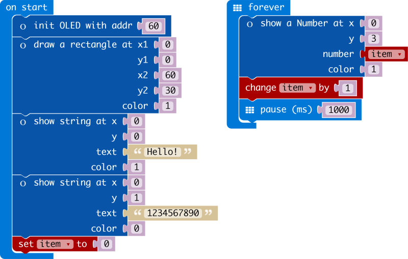

# 麦克斯韦 blinkit扩展

作者: ylp 
日期: 2023年11月13日  

  
  

## 添加扩展

打开您的microbit makecode项目，在扩展中，粘贴  

https://github.com/zhuning239/OLED  

搜索框，然后搜索，并点击添加。  

## 基础说明

```
let item = 0
OLED12864_I2C.init(60)
OLED12864_I2C.rect(0, 0, 60, 30, 1)
OLED12864_I2C.showString(0, 0, "Hello!", 1)
OLED12864_I2C.showString(0, 1, "1234567890", 0)
item = 0
basic.forever(() => {
    OLED12864_I2C.showNumber(0, 3, item, 1)
    item += 1
    basic.pause(1000)
}) 
```

## API库

- **init(addr: number)**  
initialize OLED module.
addr: OLED I2C address, it maybe 60 or 61, depend on hardware, default is 60.

- **zoom(d: boolean = true)**  
set zoom mode. In zoom mode, it will show in double size.  
d: mode
  - true, zoom mode.
  - false, normal mode.

- **on()**  
turn on OLED.

- **off()**  
turn off OLED.

- **clear()**  
clear all content in OLED.

- **draw()**  
force redraw the content.  

- **invert(d: boolean = true)**  
show in invert mode.

- **pixel(x: number, y: number, color: number = 1)**  
set a pixel in OLED.
  - x, X alis position, 0 - 63 in zoom mode, 0 - 127 in normal mode.  
  - y, Y alis position, 0 - 31 in zoom mode, 0 - 63 in normal mode. 
  - color, draw color, it can be 1 or 0.

- **showString(x: number, y: number, s: string, color: number = 1)**  
show a text at specified position.
  - x, X alis position, 0 - 11 in zoom mode, 0 - 23 in normal mode.  
  - y, Y alis position, 0 - 3 in zoom mode, 0 - 7 in normal mode. 
  - s, the text will be show
  - color, draw color, it can be 1 or 0.

- **showNumber(x: number, y: number, num: number, color: number = 1)**  
show a number at specified position.
  - x, X alis position, 0 - 11 in zoom mode, 0 - 23 in normal mode.  
  - y, Y alis position, 0 - 3 in zoom mode, 0 - 7 in normal mode. 
  - num, the number will be show
  - color, draw color, it can be 1 or 0.

- **hline(x: number, y: number, len: number, color: number = 1)**  
draw a horizontal line.  
  - (x, y), start point
  - len, length of the line
  - color, draw color, it can be 1 or 0.

- **vline(x: number, y: number, len: number, color: number = 1)**  
draw a vertical line.  
  - (x, y), start point
  - len, length of the line
  - color, draw color, it can be 1 or 0.

- **rect(x1: number, y1: number, x2: number, y2: number, color: number = 1)**  
draw a rectangle.
  - (x1, y1), start point
  - (x2, y2), end point
  - color, draw color, it can be 1 or 0.

## Demo

  

## License

MIT

## Supported targets

* for PXT/microbit


